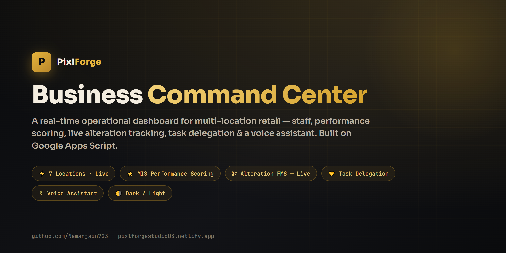
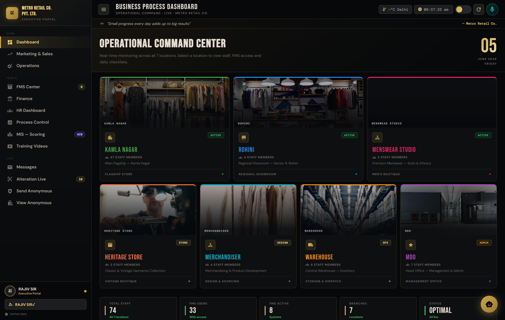
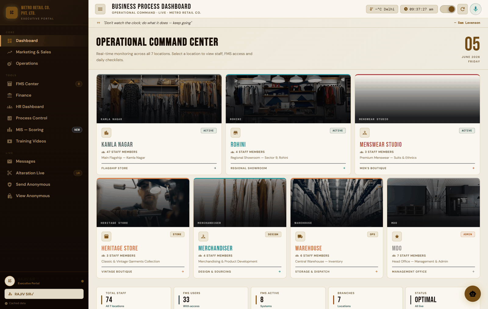
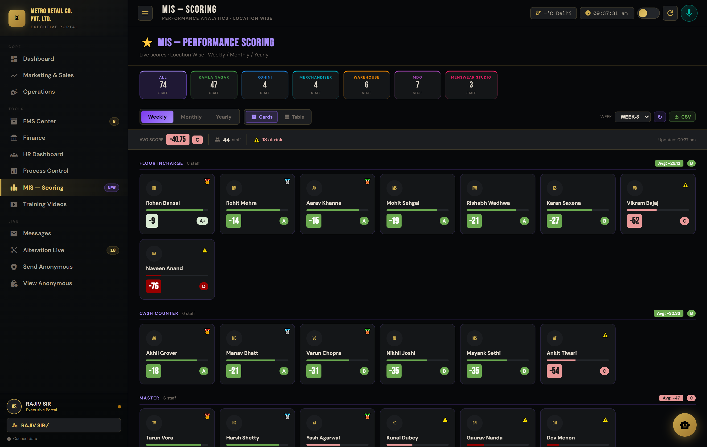
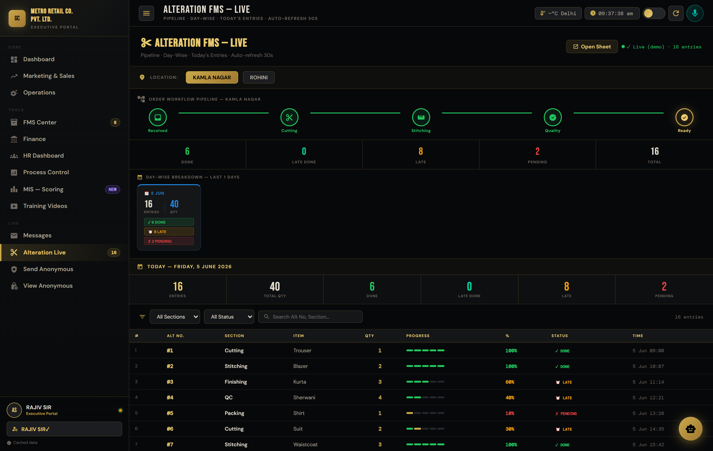
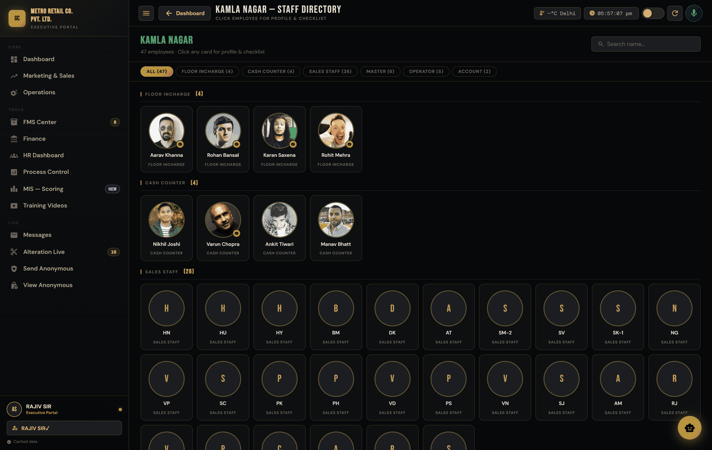
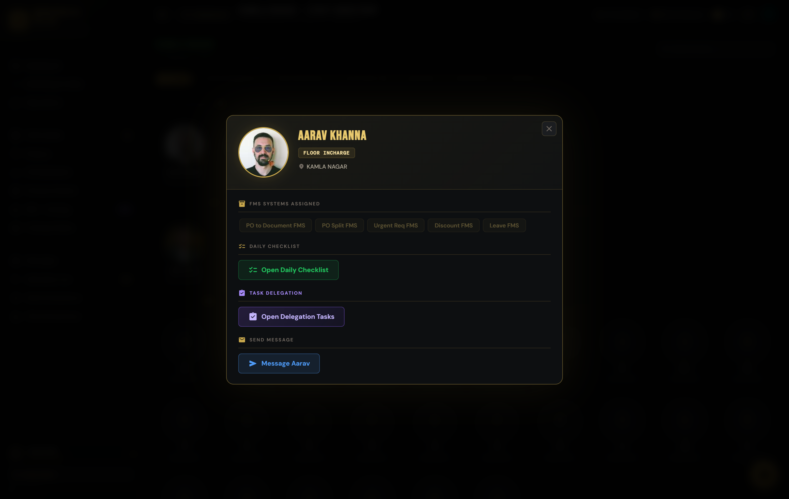
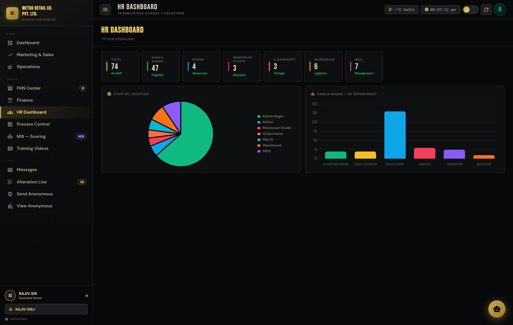
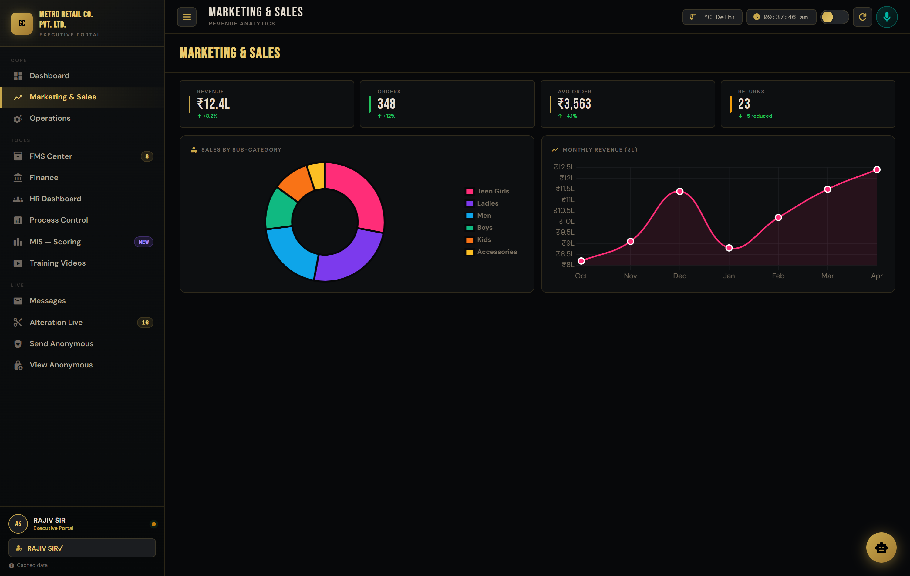
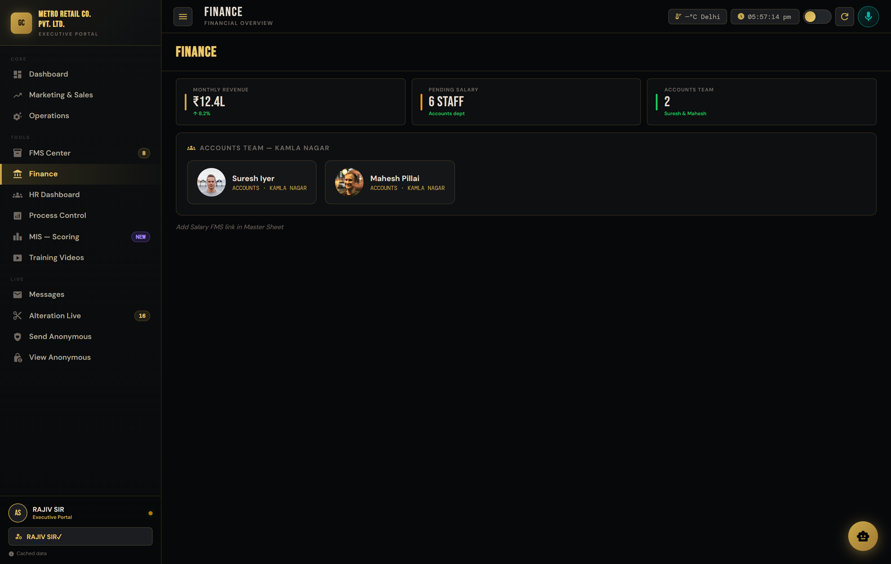

<!-- PixlForge Business Command Center - README -->

<p align="center">
  
</p>

<h1 align="center">PixlForge - Business Command Center</h1>

<p align="center"><b>A real-time operational command center for multi-location retail businesses.</b><br>
Live store monitoring · weekly performance scoring · alteration tracking · task delegation · voice control - <b>one screen, everything.</b></p>

<p align="center">
  
  
  
  
  
  
</p>

<p align="center">
  <a href="#-live-demo"><b>▶ Live Demo</b></a> ·
  <a href="#-features">Features</a> ·
  <a href="#-screenshots">Screenshots</a> ·
  <a href="#-architecture">Architecture</a> ·
  <a href="#-about-pixlforge">Hire PixlForge</a>
</p>

---

## 📌 Overview

Most growing retail businesses run on a mess of WhatsApp groups, paper registers and a dozen
disconnected spreadsheets. Owners can't see what's happening across their stores in real time,
performance reviews are guesswork, and tasks fall through the cracks.

**The Business Command Center** replaces all of that with **one live executive dashboard**. Every
employee, store, task, alteration job and performance score flows from a single master Google
Sheet into a clean, fast, mobile-friendly web app - no servers, no monthly SaaS fees, no vendor
lock-in. It runs entirely on **Google Apps Script + Google Sheets**, so the business *owns it
forever*.

> 💡 **The business case:** this single dashboard replaces several paid tools (HR tracker,
> task manager, performance software, store-monitoring apps). Built once, owned outright -
> it typically pays for itself within the first month and then runs for free.

This repository is a **fully interactive, anonymized demo** built on **100% fictional data**
(see [Data & Privacy](#-data--privacy)). It mirrors a real production system delivered to a
185-employee, 7-location retail company.

---

## ▶ Live Demo

The dashboard is **fully self-contained** - it ships with realistic synthetic data and needs
**no backend, no API keys and no login** to run.

- 🌐 **Try it locally:** open [`dashboard/index.html`](dashboard/index.html) in any modern browser.
- ☁️ **Deploy it live in 30 seconds:** drag the [`dashboard/`](dashboard/) folder onto
  [Netlify Drop](https://app.netlify.com/drop) → you get a public, interactive link instantly.

> When no live Google Apps Script backend is configured, the dashboard automatically switches to
> **Demo Mode** and generates believable scores, alteration jobs and staff data on the fly.

---

## ✨ Features

| | Module | What it does |
|---|---|---|
| 🏬 | **Operational Command Center** | Real-time tiles for all 7 locations - headcount, status, FMS access, drill-down to any store. |
| ⭐ | **MIS Performance Scoring** | Auto-grades every employee **A+ → F** weekly / monthly / yearly, grouped by department, with 3-week decline & improvement alerts and CSV export. |
| ✂️ | **Alteration FMS - Live** | Live order-workflow pipeline (Received → Cutting → Stitching → QC → Ready) with auto-refresh, day-wise breakdown and on-time/late tracking. |
| 🤝 | **Task Delegation** | Assign tasks to staff, employees tap **Mark Done**, system records On-Time / Late automatically and scores accordingly. |
| ✅ | **Daily Checklists** | Per-employee recurring checklists with time-window logic and manager view. |
| 👥 | **HR Dashboard** | Live headcount, department & location breakdown with charts. |
| 📈 | **Marketing & Sales** | Revenue analytics and live charts. |
| 🗂️ | **8 FMS Systems** | PO, PO-Split, Alteration, Inventory, Leave, Salary, Discount & more - linked from one place. |
| 🎙️ | **Voice Assistant** | Hands-free control - "how many staff in *Westside*", "open MIS", "mark attendance done", read tasks aloud, confirm before acting. |
| 💬 | **Messaging + Anonymous Feedback** | Internal messaging and an anonymous feedback channel for staff. |
| 🌗 | **Dark / Light Theme** | One-tap theme toggle, remembered per device. Fully responsive (desktop / iPad / iPhone). |

---

## 📸 Screenshots

### Operational Command Center - Dark & Light
<p align="center">
  
  
</p>

### ⭐ MIS Performance Scoring - auto-graded, department-wise
<p align="center"></p>

### ✂️ Alteration FMS - live order pipeline
<p align="center"></p>

### Staff Directory · Employee Profile · HR Dashboard
<p align="center">
  
  
  
</p>

### Marketing & Sales · Finance
<p align="center">
  
  
</p>

---

## 🏗 Architecture

```
┌─────────────────────────────┐         ┌──────────────────────────────┐
│   Google Sheets (Master)    │         │   Apps Script Web Apps         │
│   • Employees  • Tasks      │  ◀────▶ │   • Checklist API              │
│   • MIS Scores • Alteration │  doGet  │   • Delegation API             │
│   • Messages   • Notices    │         │   • MIS / Sync / Sales APIs    │
└─────────────────────────────┘         └───────────────┬──────────────┘
                                                         │ JSON
                                                         ▼
                                   ┌────────────────────────────────────┐
                                   │   Dashboard (single-file web app)  │
                                   │   Vanilla JS · Chart.js · Web Speech│
                                   │   Deployed to Netlify / Apps Script │
                                   └────────────────────────────────────┘
```

- **No database server, no hosting bill** - Google Sheets *is* the database; Apps Script *is* the API.
- **Single-file frontend** - the entire dashboard is one portable `index.html`.
- **Graceful demo fallback** - runs fully offline with synthetic data when no backend is set.

More detail in [`docs/ARCHITECTURE.md`](docs/ARCHITECTURE.md) and [`docs/FEATURES.md`](docs/FEATURES.md).

---

## 🔒 Data & Privacy

This is a **public showcase**, so every piece of client data has been removed and replaced:

- ✅ All **employee names, photos and emails** → fictional names + **royalty-free placeholder portraits** (random people, *not* real staff) and generated initials for coded roles.
- ✅ All **company branding, store names and the master sheet** → a fictional brand, *Metro Retail Co.*
- ✅ All **live backend URLs, API keys and Google Drive / Sheet IDs** → stripped out.
- ✅ Figures, scores and jobs shown in the demo are **randomly generated and not real**.

The complete production source (live backends, scoring engine, automations) is maintained
privately and delivered as part of an engagement. See [`docs/SECURITY.md`](docs/SECURITY.md).

---

## 🗂 Repository Structure

```
pixlforge-command-center/
├── dashboard/
│   └── index.html        # ← the full interactive demo (deploy this)
├── assets/               # banner + screenshots
├── docs/
│   ├── ARCHITECTURE.md
│   ├── FEATURES.md
│   └── SECURITY.md
├── LICENSE
└── README.md
```

---

## 👋 About PixlForge

**PixlForge** builds production-grade dashboards, internal tools and AI automation for
operations, retail and finance teams - the kind of software that replaces spreadsheets and
monthly SaaS subscriptions with something a business owns outright.

- 📧 **Email:** [info@pixlforgestudio.in](mailto:info@pixlforgestudio.in)
- 📬 **Direct:** [namancric18@gmail.com](mailto:namancric18@gmail.com)
- 🌐 **Portfolio:** [pixlforgestudio.in](https://pixlforgestudio.in/)
- 💼 **GitHub:** [@Namanjain723](https://github.com/Namanjain723)

> 💬 **Want a command center like this for your business?**
> I build custom operational dashboards on Google Workspace, Netlify or your own stack.
> **Message me for a free walkthrough** - I'll map your current process and show you exactly
> what a single dashboard could replace.

---

## 🤖 AI Support

This project uses **Anthropic Claude** as a development copilot for:

- ✍️ Documentation writing
- 💡 Idea refinement
- 🧩 Minor code suggestions

All architecture, product decisions, integration and final engineering are by **Naman Jain / PixlForge**.

---

## 📜 License

See [`LICENSE`](LICENSE). This is a **portfolio / demo project** - free to view and evaluate,
**not for redistribution or resale**. Commercial deployment and customization are available as a
service engagement.

---

<p align="center">
  <sub>⚡ Built with production discipline · <b>Developed by Naman Jain</b> · © PixlForge</sub>
</p>
